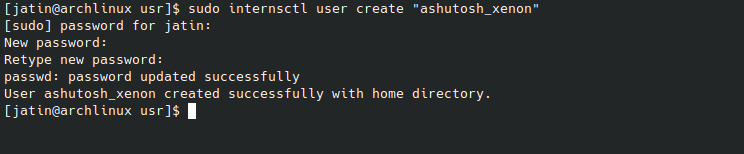

# Video Streaming Web Application

This is a MERN (MongoDB, Express.js, React.js, Node.js) stack-based web application for video streaming.

## Getting Started

To get started with this project, you'll need to follow these steps:

### Prerequisites

Make sure you have the following installed on your machine:

- Node.js: [Download and Install Node.js](https://nodejs.org/)
- MongoDB: [Download and Install MongoDB](https://www.mongodb.com/try/download/community)

### Clone the Repository

git clone https://github.com/Ashutoshvashisht007/Video-Streaming-Web-app/

# Install Dependencies

cd server  
npm install

<h3>Create a .env file in the backend directory and add the following:</h3>

MONGO=your-mongodb-connection-string
JWT=your-secret-key

# Front-End Dependencies

cd frontend  
npm install

# Run the application

<h3>Front End</h3>
npm run start

<h3>Back End</h3>
npm run start

Screen Shots of the Application

Home Page
.png)

 

Sign In
.png)

 

Subscription
.png)

 

Signed In
.png)

 

Linux Commands

Cpu Usage

 

Memory Usage

 

Create user

 

User List
 

 

File Info

